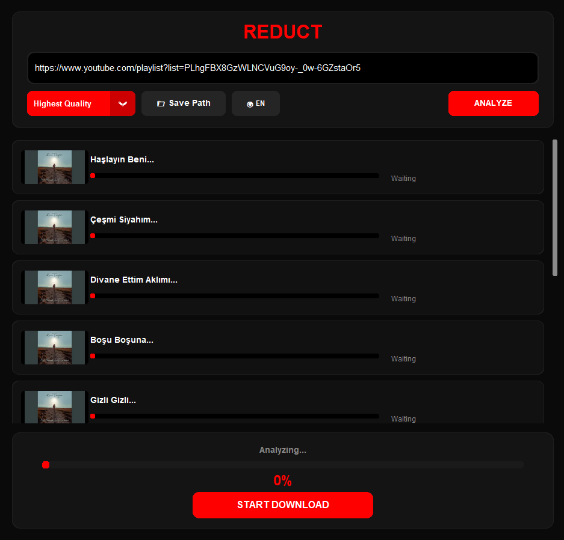

# Reduct PRO 🚀

**Reduct PRO** is a high-performance, modern YouTube video and playlist downloader. Designed with a sleek dark-themed UI, it provides a seamless experience for fetching your favorite content in the highest quality possible.

## ✨ Key Features

* **🎥 High-Quality Downloads:** Support for 1080p, 4K, and the best available resolutions.
* **📜 Playlist Support:** Analyze and download entire playlists with a single link.
* **🎨 Modern UI/UX:** A clean, dark-mode interface designed for professional use.
* **🔍 Advanced Analysis:** Rapidly fetches video details, thumbnails, and metadata.
* **🌍 Multi-Language:** Built-in support for English (EN) and Turkish (TR).
* **💾 Organized Saves:** Custom path selection for easy file management.

## 🖼️ Application Preview

*Reduct PRO in action: Analyzing a playlist with multiple videos.*

## 🚀 Getting Started

1.  **Download:** Go to the `dist` folder and download `Reduct_PRO.exe`.
2.  **Run:** Launch the application on your Windows machine.
3.  **Paste & Analyze:** Paste a YouTube Video or Playlist URL and click **ANALYZE**.
4.  **Download:** Choose your quality settings and hit the **DOWNLOAD** button.

---

## 🛠️ Technical Details

* **Framework:** Python / CustomTkinter (Modern UI Library)
* **Backend:** Advanced YouTube-DL integration for high speed.
* **Platform:** Windows

## ⚠️ Disclaimer

This tool is created for **educational purposes only**. Please respect the copyrights of content creators. Downloading copyrighted material without permission is against YouTube's Terms of Service. The developer is not responsible for any misuse of this tool.

## 📜 License

This project is licensed under the **MIT License**. See the [LICENSE](LICENSE) file for details.
